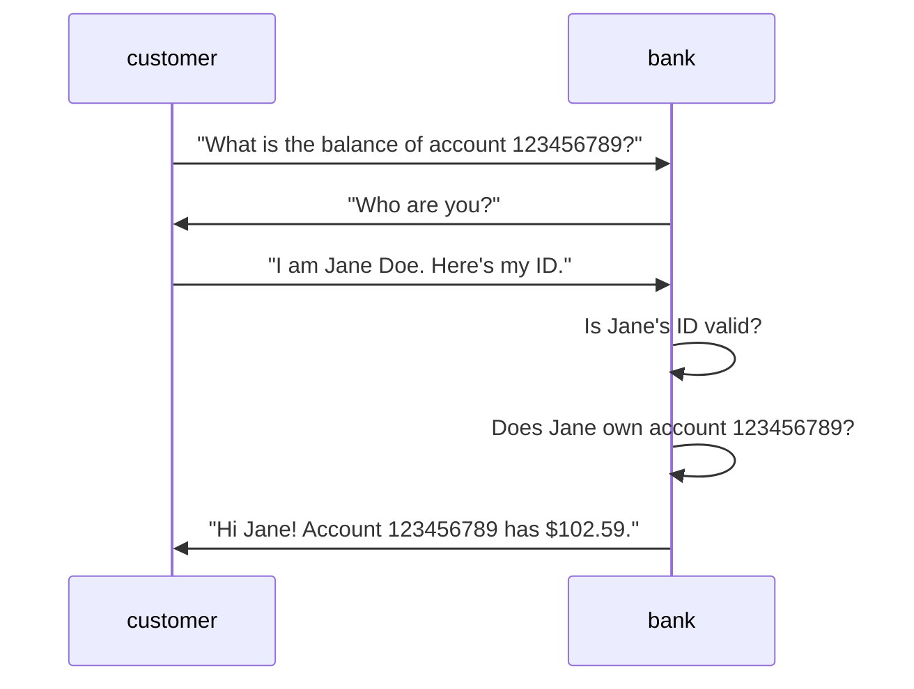
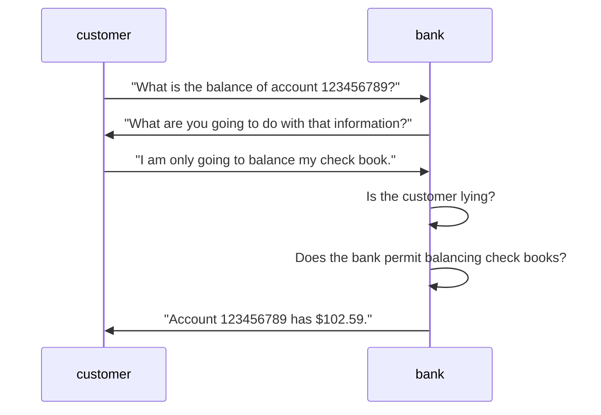
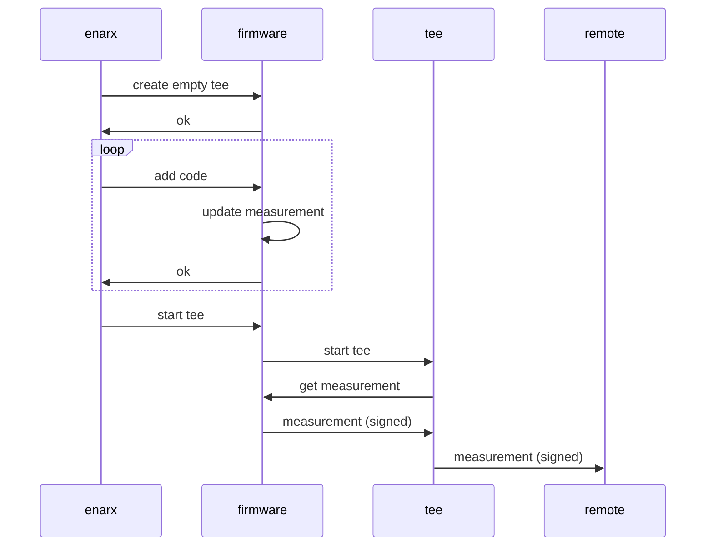
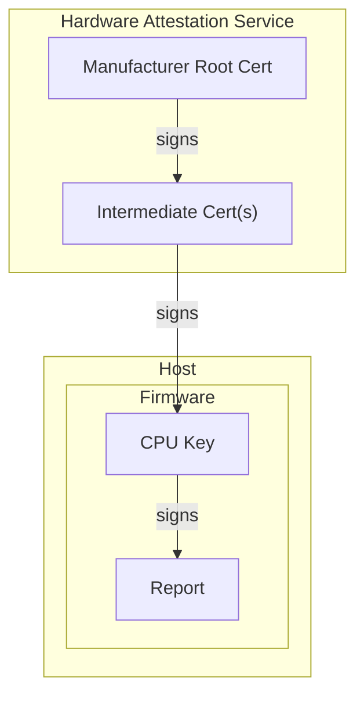
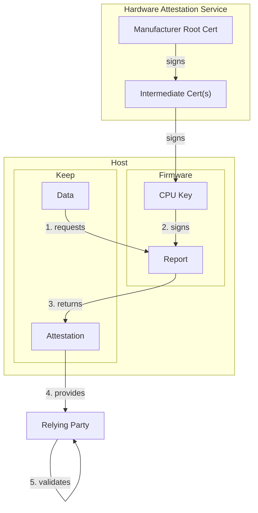

# Attestation Concept

###### tags: `Design`
| Author | Period | State |
| -------- | -------- | -------- |
| Nathaniel McCallum Richard Zak Harald Hoyer Dmitri Pal | November-December, 2022 | :red_circle: **Draft** |

## Introduction

The purpose of this document to provide a high level explanation of the **attestation** concept. Attestation plays a key role in Confidential Computing. We will start with why attestation is needed and work our way "downwards" to how each point of data is required.

## Authentication & Authorization

Authentication is a system which attempts to identify the person or organization associated with an operation. It often looks something like the following scenario where Jane wants to find out how much money is in her bank account:

In the above example, if the bank gave information about the account to anyone who asked then no one would have any privacy. Instead, the bank performs two checks: authentication and authorization, respectively. In the first check, the bank **authenticates** Jane by confirming that she is who she says she is. In the second check, the bank **authorizes** Jane by confirming that Jane should be allowed to have information about the account in question.

However, imagine that Jane has an identical twin sister named Jody. If Jody can steal Jane's ID, then Jody can access the account information *even though she is not Jane*. This is because Jody was able to gain access to Jane's **credentials**.

In fact, this very scenario is the cause of most data breaches. In the vast majority of data breaches, the authentication and authorization system works as designed. The failure is simply that someone other than Jane was able to pretend to be Jane.

## Attestation & Authorization

Imagine, using the prior scenario, that we had a machine that could perfectly detect what the person would do with the data that we gave them. Then the exchange could look like this:

This process of determining what application code will do with information is called **attestation**. Attestation is an alternative approach to authentication which **identifies the code** that is receiving the data rather than a person or organization.

Attestation is effectively a new type of authentication.

In traditional authentication (`authn`) schemes, the goal is to identify a person or organization associated with an operation. For example:

* [HTTP Basic Authentication](https://en.wikipedia.org/wiki/Basic_access_authentication) uses a `password` and yields a `username`.
* A [PKIX X.509 Certificate](https://datatracker.ietf.org/doc/html/rfc5280) uses hierarchical signing to yield a `subject` or a `san` (Subject Alternative Name).

Attestation is similar, but instead of identifying the person or organization it identifies the code that is used. In the simplest case, this identity is a cryptographic hash of the initial memory contents of a Trusted Execution Environment (TEE; in Enarx, called a **Keep**).

Like traditional X.509 authentication, attestation is typically implemented using a hierarchical key certificate structure. The CPU contains an asymmetric key pair that is only available for use to the CPU firmware. The public key of this key pair is then signed by a certificate chain which goes back to the CPU manufacturer.

In turn, the firmware provides a method to a Keep for generating an **attestation report**. Since this method is only available from inside the Keep, it can be used to identify the initial state of a Keep. The attestation report contains information about the platform, such as the CPU firmware version, along with information about the Keep (such as a cryptographic measurement of the initial state).  This method additionally accepts an **opaque blob** (often called the nonce) from the Keep for inclusion in the attestation report. This allows the attestation report to prove that certain data (like a public key) was produced from inside the Keep.

## Requirements for Attestation

In order for attestation to work we need to be able to guarantee the following properties of the remote code:

1. **integrity of application code & data** - without this guarantee, an attacker could change what the code will do with the data after attestation has completed.
2. **confidentiality of application data** - without this guarantee, an attacker could simply take the data and use it for purposes other than the attested code.

These properties are the minimum requirements in the Confidential Computing definition as defined by the [Confidential Computing Consortium](https://confidentialcomputing.io). A system which provides these properties is called a **Trusted Execution Environment (TEE)**.

> 📝 A TEE containing the Enarx runtime is called a **Keep**.

## Attestation Primitives

### Code Measurement

Attestation technologies, to be discussed in detail below, today provide a single primitive for communicating what code will do with data provided: **measurement**. Before executing the first instruction in a TEE, the hardware uses a cryptographic hash to measure the initial state of a TEE. This uniquely identifies the code that will run in this TEE. Once the TEE is running, it can request a (signed) copy of the initial measurement. This can be passed to a remote party for validation. For example:

But how can the remote party (sometimes called a **relying party**) trust that the measurement it received is valid? For that we need a hardware root of trust.

### Hardware Root of Trust

For a relying party to trust any given measurement, it needs assurance that the measurement was produced by the hardware that instantiated the TEE and not by some fraudulant software process or vulnerable hardware. For this reason, the relying party does not receive a measurement by itself. Rather, the relying party recieves a complete **attestation report** which contains an application measurement along with information about the hardware and firmware which created the TEE.

This attestation report is then signed by a private key from a key pair known only to the CPU which produced the TEE. In order for the relying party to trust this key pair, the public key is signed by a hierarchical key certificate structure with the root certificate being provided out of band by the hardware manufacturer.

The relying party can validate this hierarchical certificate structure in order to establish trust that the attestation report was generated by an actual CPU. The resulting structure looks like this:

### Attestation Data

It is still, however, insufficient to receive a signed attestation report. An attacker could, for example, copy an attestation report from another process and simply reuse it. Therefore, there needs to be some way to bind an attestation report to some particular data. This ensures to the relying party that the data was produced inside of a TEE.

To facilitate this, the method within a TEE to request an attestation report allows the caller to specify some attestation data to be included in the report. This opaque data field will then be signed by the CPU key along with the other data in the report. Often this opaque data field will contain a `nonce` or the hash of a `public key` or other unique material.

Putting this entire process together in a single diagram looks like this:

After receiving the attestation from the Keep, the relying party looks at the details provided in the attestation report validating that all the elements of the attestation were properly assembled and that the signature provided by the hardware is valid.

Further documents would explain the attestation flow in more details.
