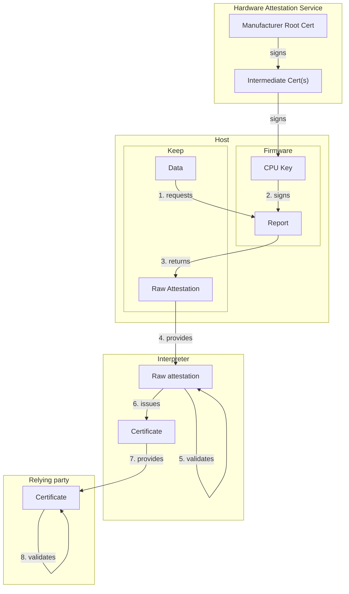
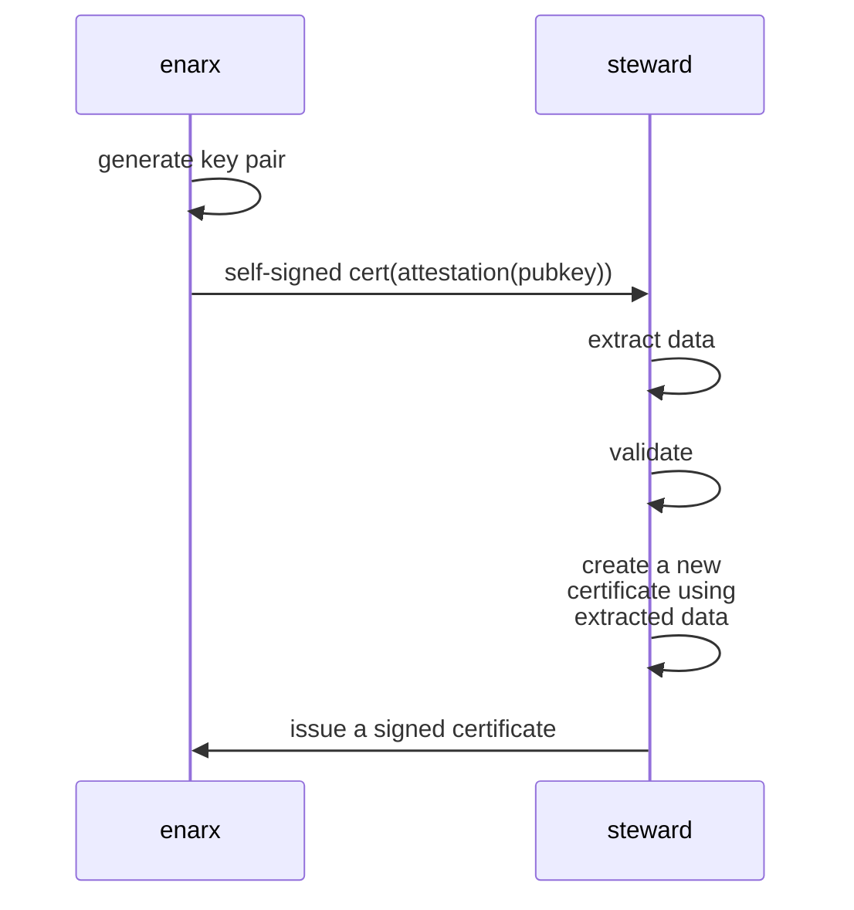
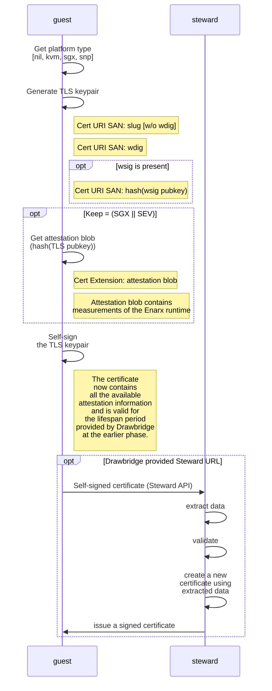

# Attestation Flow
###### tags: `Design`
| Author | Period | State |
| -------- | -------- | -------- |
| Nathaniel McCallum<br>Richard Zak<br>Harald Hoyer<br>Dmitri Pal | November-December, 2022 | **🔴 Draft**  |


## Introduction

This document is the continuation of the discussion about the attestation flow, started in the [Attestation Concept](https://hackmd.io/@enarx/r1Yg2kb_s) document. It focuses on the entity that receives the attestation report from a Keep, inspects it and validates that the Keep was properly created on the hardware which keys are still trusted.

## Complexity of the validation

An attestation report is difficult to consume. It requires careful analysis of a signature hierarchy along with platform state. Likewise, managing the cryptographic measurements of supported applications is tedious and error-prone. Attestation validation, on the other hand, needs to be simple and auditable.

> Most attestation validators really only care to answer the question "What is the name and version of the application?"
> 
There are multiple hardware vendors that offer the ability to run workloads within the encrypted memory. While in general the capability is the same, the implementation is quite different. The relying party that receives and validates the attestation report, has to be intimately familiar with the details of the specific attestation process and know how to review and validate provided data. 

It would have been great, if there were a universal interpreter that on one side could process the raw attestation data delivered by the keep and on the other could produce a simpler and more conventional report that can be easily verified by already existing tools and protocols. 





### What is Steward?

Steward is an attestation-aware certification authority designed to act as such interpreter. The Keep generates a key pair and produces an attestation report proving that the private-public key pair was generated inside of a keep. Steward receives this attestation report as input and, if validation is successful, issues a certificate for the generated key pair. This allows us to convert a proprietary attestation report into a standard X.509 certificate for use with protocols like TLS.

To improve interoperability, Keep uses a self-signed certificate as a vehicle of delivery of the attestation report and related metadata to Steward.



#### Division of Labor

One of the goals of Steward is to reduce the amount of validation that is required by third parties. Enarx deploys WebAssembly workloads into Keeps. So this means there are effectively three kinds of validation that must occur:

1. Validation of the hardware platform
2. Validation of the Enarx runtime
3. Validation of the workload

Steward validates both the hardware platform and the Enarx runtime. Steward **DOES NOT** validate the workload. However, Steward issues a certificate, that the Keep presents to the workload registry. Registry releases the signed workload to the Keep and the Keep does the validation of the workload.

For more details about this part of the flow see [Full Provisioning Flow with Attestation](https://hackmd.io/@enarx/rJ55urrvo) document.

## How do you get an Attestation?

Enarx shims provide a syscall extension named [`get_attestation()`](https://enarx.dev/docs/technical/attestation-syscall). It is defined as follows (see the previous link for full documentation):

```c
ssize_t
get_attestation(
    void *nonce,
    size_t nonce_length,
    void *buf,
    size_t buf_length,
    size_t *technology
);
```
This takes an opaque blob as input (i.e. `nonce`) and writes the attestation into the provided buffer (i.e. `buf`). This function also outputs a `technology` identifier (i.e. SGX or SEV). This call is not currently exposed to WebAssembly code.

## How does Steward use Attestation?

This section is connected to the section 
of the [Full Attestation Workflow](https://hackmd.io/@enarx/rJ55urrvo#PHASE-3b-Establish-Workload-Identity) document and focuses on the Steward side of processing the attestation



## What is in the attestation report?
The reports contain a lot of information regarding the model, revision, and firmware version for the CPU. Some items aren't of concern to Steward, some things need to be checked to ensure safety, and other fields need to be customizable based on some criteria.

What makes this complicated is that SGX and SNP don't have the same fields, so it makes it more difficult to be consistent.

Goals for attestation configuration:
* White-list trusted, signed release versions of Enarx. Ensure that the proper version is running, and not some version which has been re-compiled, and possibly altered.
* Black-list compromised or obsoleted Enarx versions.
* Black-list compromised or obsoleted CPU firmware versions.

Non-negiotable aspects of attestation validation in Steward:
* Ensure proper algorithms, SGX uses Elliptic Curve NIST P256, SNP uses Elliptic Curve NIST P384. Anything else is evidence of tampering with the data.
* Ensure the report is signed with a valid signature.
* Ensure the signature validates with the CPU's public key.
* Ensure the CPU's public key is part of the vendor's certificate chain.
* Ensure reserved fields in the attestation report are zeroed.
* Ensure certain fields in the report which are set by Enarx are not zero (these may be checked by an optional attestation configuration file, above).
* Ensure that KVM and debug mode SGX, SNP are only allowed if Steward is in debug mode.
* Check CPU cert and vendor intermediate certs against vendor's CRL(s) **missing**

### SNP
Below are fields for SNP we which are configurable due to being relevent to security.

* Policy
  * Minimum ABI major, minor versions, check, currently 1.51, use this for only allowing secure version
  * Debug mode (never when Steward not in debug mode)
  * Single or Multiple CPUs allowed
  * Migration allowed (never allowed)
  * SMT allowed
* Signing Algorithm, `u32`, must be `1`
* PlatformInfo
  * SMT
  * TSME
  * More info https://developer.amd.com/wordpress/media/2013/12/AMD_Memory_Encryption_Whitepaper_v7-Public.pdf
* author_key_en, `u32`, should be 1 since we provide signing info
* measurement, `[u8; 48]`, hash of Enarx in memory
  * Whitelist of allowed hashes
  * Blacklist of denied hashes 
* id_key_digest: `[u8; 48]`, signing key of the Enarx binary, optionally don't care
* author_key_digest, `[u8; 48]`, signs ID key above
  * Whitelist of allowed keys
  * Blacklist of denied keys
* [current|committed]_[build|minor|major], `u8` for each
  * Check that Policy ABI matches **current** minor|major (hard-coded Steward, not config file)

### SGX

* Enarx public key signer, `[u8; 32]`
* CPU SVN, `[u8; 16]`, not lower than some configured value
    * Must be checked against Intel's TCB API
    * https://github.com/profianinc/steward/issues/112
    * https://github.com/enarx/enarx/issues/2380 
* Features
  * make sure not debug unless Steward is in debug mode
  * Force 64-bit mode, required by Wasmtime
* Enclave product id, `[u8; 2]`
* rpt.enclave_product_id(), must be the configured version
* rpt.enclave_security_version(), check not less than some value we specify, currently zero

## What's missing in the Steward implementation?
* Steward allows for several CSRs to be sent, ideally to provide a certificate for different uses of keys (signing, encryption, CA, etc). This is not yet implemented in Enarx.
  * Enarx only sends one CSR.
  * Enarx only creates one keypair for the workload.
  * Likely waiting on Crypto VFS.
* How to handle debug mode:
  * Whole Steward is debug or not, or
  * Debug mode per Technology (allow debug SGX not SNP, for example),
  * If debug per Technology, when to allow KVM?
  * Rename KVM, since same applies for `Nil`?
* Place information about the Technology as extra data in the certificate? This would allow third parties to know more about the underlying technology versus just trusting all certs signed by a Steward are in a Keep.
  * Privacy vs. allowing a client to know that the application in a Keep isn't running a compromised version of SNP, SGX. Or provide extra assurances that the application is secure and running with latest CPU firmware after a vulnerability disclosure.
    * Extension with version number, or hash, of the CPU's firmware/TCB?
    * Different certificate chain per Technology?
* Checking Intel TCB
    * https://github.com/profianinc/steward/issues/112
    * https://github.com/enarx/enarx/issues/2380
* Checking certificates against vendor CRLs
    * https://github.com/enarx/enarx/issues/2389 
* Customizing certificate validity for Steward-signed certificates.
* Should Steward have a CRL URL?
    * OCSP instead
    * What if attestation config for a technology changes while some certs are still valid?
    * Need attestation data in the issued cert for periodic re-attestation