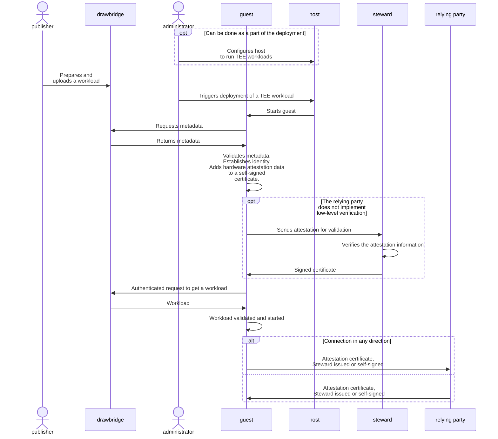
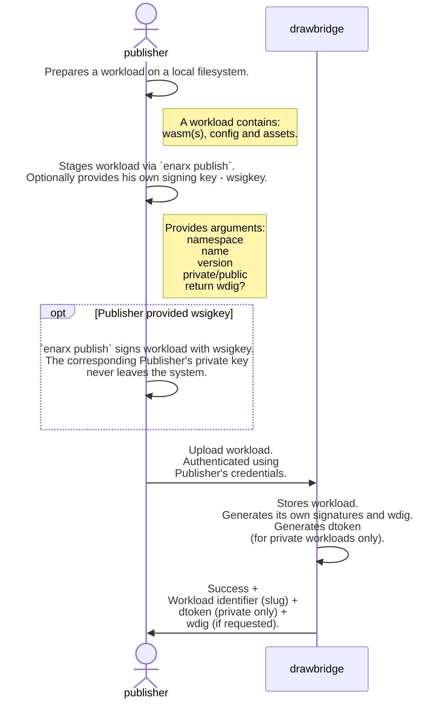
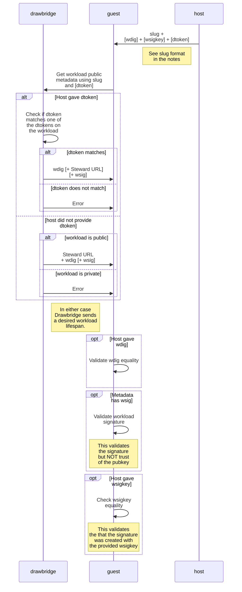
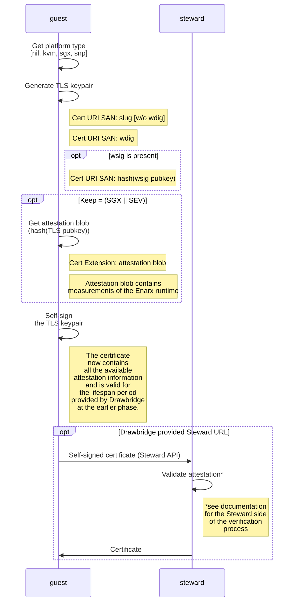
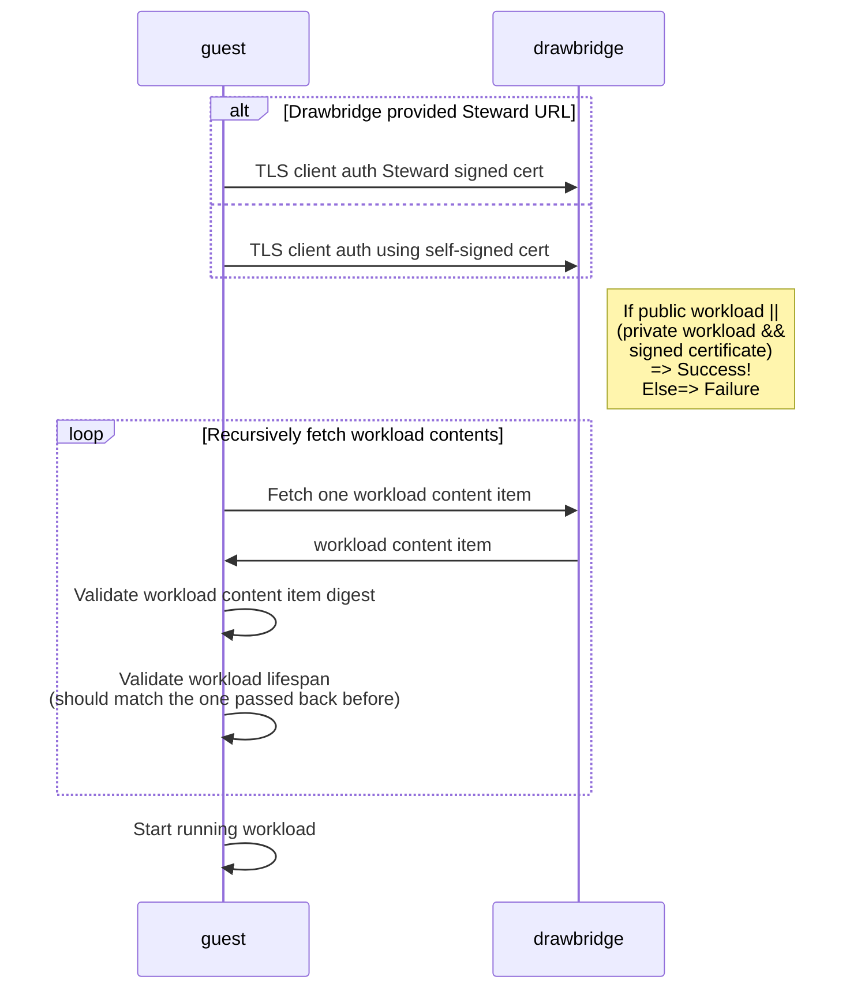
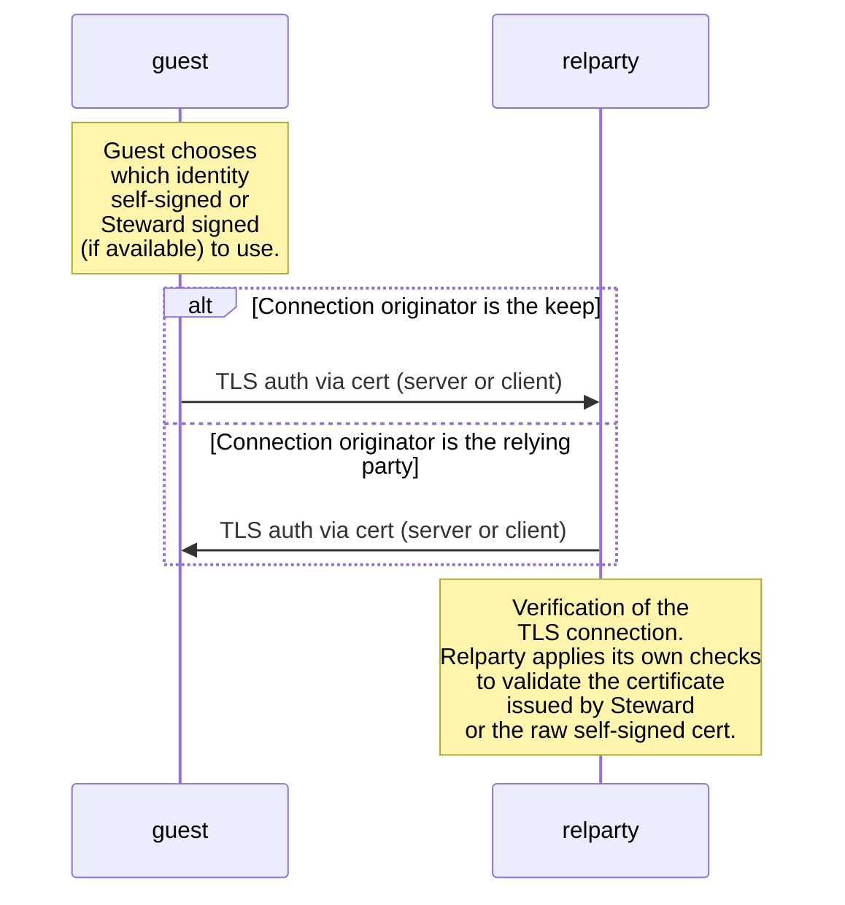

# Full Provisioning Flow with Attestation

###### tags: `Design`
| Author | Period | State |
| -------- | -------- | -------- |
| Dmitri Pal | December 2022 | **Draft** |

## High level architecture

This document describes the detailed architecture of the Enarx attestation workflow. For a more high-level view and concepts related to the Confidential Computing Attestation flow please read the following [document](https://hackmd.io/@enarx/r1Yg2kb_s). 

## Involved parties

**Participants:**

| Name           | Purpose/Function | Modality |
| -------------- | ---------------- | -------- |
| Drawbridge     | The registry, that stores workloads that will be executed in a TEE | This is a required component of the architecture. |
| Steward        | The attestation service. Validates low-level vendor-specific attestation information provided by the hardware and translates it into a generic attestation certificate that can be easily validated by software capable of validating certificates. | There are four different ways to use the Steward: 1) use Profian's Steward, 2) use a private instance of Steward, 3) attest without a Steward by re-implementing the logic in the relying party, 4) don't attest at all|
| Host           | The system where the Confidential Computing workload will be deployed. Also refers to the OS and userspace of that system. | Required. |
| Guest          | The software stack that would run a workload. It is usually deployed into TEE but in some cases (development) can be deployed into a VM or with so called NUL back end, that provides emulation of a TEE for development purposes. In this document, we mostly focus on the operation the guest conducts before it acquires and starts a workload it needs to run.| Required.|
| Relying party  | A software component (a service or server) owned by the deployment owner (administrator), that asserts the attestation certificate provided by the attestation service (Steward) or implements the validation itself. Running workloads without the validation of an attestation violates the Zero Trust concept and do not leverage the value the technology offers to reduce the attack surface and assure that the data is actually protected. | Highly recommended. |

**Actors:**

| Name           | Role/Function  |
| -------------- | -------------- |
| Publisher      | Publisher is the person responsible for making a workload available for execution. In some situations, a Publisher can be a developer, but in general cases these roles are separate.      |
| Administrator  | The person that manages the hosts in the environment and makes sure that the systems are properly configured to run the workloads. He then directly or indirectly triggers the execution of the workloads in the TEEs on the target hosts. |

The following diagram provides a high-level flow:

The rest of the document provides the next level of details about the solution.

## Prerequisites

* Either:
    * A public (Profian operated) instance of Drawbridge service is accessible to the parties listed in the flows.
    * Customer deploys a private Drawbridge service accessible to the parties listed in the flows.
* Either:
    * A public (Profian operated) instance of Steward service is available to the parties listed in the flows.
    * Customer deploys a private Steward service accessible to the parties listed in the flows.
* Drawbridge is configured to use a specific instance of Steward (in general, a customer can choose to use different instances of Steward for different workloads). By default, without any override, the deployed public or private instance of Drawbridge assumes the **public instance of Steward**. This means that a private instance of Drawbridge will work with a public or private (if deployed and configured) instance of Steward. In some cases, the workload configuration can specify that the use of Steward is not required. In this case, it is expected that the relying party takes the responsibility of implementing the same low-level validation as Steward does.
* Developer has created a workload and compiled it to WebAssembly generating WASM bytecode binary.

## Overall Flow

### PHASE 1 : Workload Publisher Stages Workload

**Overview:**

* This sequence starts by the **Publisher**. 
* During this phase the **Publisher** prepares a workload and uploads it into the **Drawbridge**.
* The sequence ends with the **Publisher** receiving the results of the upload from the registry.

**Terminology:**
* **keep** - TEE with WebAssembly run-time plus Enarx logic. Keeps are where customer workloads run. For more information see the **[documentation](https://enarx.dev/docs/start/enarx)**.
* **public workload** - a workload that can be downloaded by any execution environment without limitations. It does not require the keep to authenticate to get it.
* **private workload** - a workload that can be released only to the keep that passed attestation security checks.
* **wasm** - WASM bytecode, i.e. the application compiled to a WASM binary.
* **config** - Workload configuration data (TOML). Includes the **Steward** URL if any.
* **assets** - Additional data that the **Publisher** might want to package with the workload. This data is placed on the virtual filesystem of the keep, once the workload is delivered to the keep.
* **workload** - A **wasm** application with **config** data and **assets** data.
* **`enarx publish`** - The command line to talk to **Drawbridge** and upload the workload.
* **wdig** - The digest of the workload. This is a top-level hash of the workload package stored in the **Drawbridge**. Different parts of the workload are stored in the **Drawbridge** together with the **[Merkle tree](https://en.Wikipedia.org/wiki/Merkle_tree#/media/File:Hash_Tree.svg)** of hashes.
    * Note: The architecture currently does not differentiate the application binary and its configuration. For now it is the same application-deployment-workload concept. In future there will differentiate between the application binary (application) and the configuration of this application (deployment). So the term "workload" will most likely be retired in favor of the "application" and "deployment". The "deployment" and "application" will have hierarchical organization (one deployment might cover more than one application) and each element will be signed separately. This would allow different, more specific assessment when two applications attested by the same attestation server talk to each other.
* **wsigkey** - **Publisher's** public key used to sign the workload during the upload process.
* **wsig** - the workload signature. It is created during the upload of the workload. The signature includes the public key of the **Publisher** used to create the signature - **wsigkey**.
* **dtoken** - deployment token. A random string to bind a specific workload to a specific environment where the keep is running. A default deployment token is always generated and returned by **Drawbridge** when **Publisher** uploads a private workload.
* **slug** -  a workload identifier.
    * **Format**: [domain]/<namespace>/<workload name>:<workload version>
        * [domain] - the optional part that is used to construct the URL for the Drawbridge server. If omitted the default Profian server located at store.profian.com is assumed.
        * <namespace> - The logical organization that the workload belongs to. The organization shares a common set of users who can perform different operations within the namespace based on the defined individual permissions.
        * <workload name> - the name of the workload assigned by publisher
        * <workload version> - the version of the workload specified by publisher
    * **Example**: store.profian.com/profianinc/drawbridge:0.1.0

    

**Notes:**    
* If the signing key pair is not provided by **Publisher**, no signature is created. The signing provides an extra level of security to prove that the workload has not been tampered with. It is optional. It is highly recommended for production workloads but can be omitted in development.
* To limit the deployment of the specific workloads to specific environments, **Publisher** can define additional deployment tokens for different environments. The API and CLI to do this are out of the scope of this document. 
    * Additionally the deployment tokens (**dtokens**) can be:
        * Valid for a specific time, i.e have an expiration date
        * Valid for a number of uses, for example, single use or a limited number of launches.
        * Revoked by **Publisher**
        * Updated by **Publisher** to change/extend lifetime or number of uses 
    * The details of the deployment token management are out of the scope of this document. 
    
* As a result of this phase the **Publisher** is expected to collect the following information and make it available later at **PHASE 3**.
    * **slug** - it will be used as a required argument for workload deployment.
    * **dtoken** - deployment token required for private workloads only.
    * **wsigkey** - the **Publisher's** public key used to sign the workload. An optional argument at **PHASE 3**.
    * **wdig** - the hash of the workload as **Drawbridge** knows it. An optional argument at **PHASE 3**.

    
### PHASE 2: Preparing a Host to run a Guest
    
There are two main parts of preparing a Host to run TEE Guests:
* Delivering the Enarx binaries.
* Configuring the host to run the keeps and do the attestation correctly.

#### Enarx binaries
The Enarx binaries include three parts:
* The client side part that, i.e. Enarx client, - the CLI that runs on a host
* The bits that run in the keep:
    * Low-level shim that abstracts the hardware
    * WebAssembly run-time - WasmTime
    * Enarx keep logic
* The utility to fetch vendor specific hardware related information and corresponding certificates. This includes VCEK certificate for AMD, PCK certificate for Intel, vendor specific CRL and TCB report. More details [here](https://github.com/enarx/enarx/issues/2380). This utility is wrapped into a systemd unit file to periodically fetch the information and make it available on the host, or into a cron job configuration or a Kubernetes operator.

All these bits are a part of a single binary.

The provisioning of the Enarx bits happens outside the attestation flow and is not demonstrated below. In general, the Enarx bits need to be somehow delivered or installed on the target system - host. The delivery mechanism varies, depending on customer preferences.

The primary options are:
* Enarx binaries are installed on the host using RPM or a similar packaging system. This can be orchestrated by some provisioning and/or automation tools or done manually.
* Enarx binaries are packaged in a container, and the container is deployed towards a target node. The mechanism of how it is done (Docker, Kubernetes or something else) is not relevant here. To separate the responsibilities for delivering the bits, starting the keep and pre-configuring the host, the privileged operations to configure the host are implemented in an operator.

#### Host configuration

The Host configuration is vendor specific. It includes the following steps:
* Make sure the Kernel supports the TEE. The distribution of the Kernel is out of the scope of this document. 
* In the case of SGX two special daemons from Intel should be installed and running.
* Configure periodic fetching and caching of the vendor-specific data using one of the mechanisms described above (systemd, cron, operator, etc.)
        
As a result, the bits are installed on a target host, the host is configured and ready to accept a workload.

**Notes:**
* This phase can be done anytime before **PHASE 1**.
 &nbsp;

### PHASE 3 : Deploy and Run Workload with Attestation
    
This phase is broken into sub-phases for the readability of the diagrams. The sub-phases in this phase are a part of the single uninterrupted flow.

#### PHASE 3a : Get and Validate Package Metadata

**Overview:**
* This phase starts with the invocation of the Enarx CLI on the **Host**. The CLI can be involved manually or using some other tools or automation. The nature of this invocation is irrelevant to the flow.
* The CLI starts the workflow using `enarx deploy slug` command. From this point on, the CLI is blocked waiting for the workload to exit. If an error is encountered in any part of the flow below, the Enarx keep (the **Guest**) exits and the error is returned to the CLI (the **Host**).
* The goal of this phase is to make sure that the **Guest** has the right metadata and that the metadata is correct.
* The phase ends when the **Guest** finishes the preliminary checks or determines that no checks are possible.
    
**Terminology:**
* **lifespan** - the workload configuration (TOML) includes workload's desired lifespan on the attestation certificate. This information is sent to the guest as a part of metadata. The **lifespan** value determines the desired validity period of the certificates. See more details in the later stages of the process.

    
**Notes:**
* Providing optional arguments helps to reduce attack surface in different scenarios.
    * **wdig** is optional to pass from the host. Having a **wdig** passed to host out of band helps to make sure that the workload has not been tampered with by hijacking **Drawbridge** or spoofing DNS. It adds a level of security and is highly recommended for production deployments of private workloads.
    * **wsigkey** is optional to pass from the host. Having a **wsigkey** passed to host out of band helps to make sure that the workload has not been tampered with by replacing the workload in **Drawbridge** by someone who hijacked **Publisher's** account in **Drawbridge**. It is highly recommended for private production workloads.
    * **dtoken** is optional for public workloads and required for private workloads to make sure that the workload is allowed to be released to the specific environment, the host that run the keep. **dtoken** should be delivered to the host out of band and viewed as a secret that grants the environment the right to run the workload. If **dtoken** is stolen and used in another environment, that environment would be able to launch the workload. While the attacker would not be able to get inside the workload and see its data, he would be able to observe the workload behavior from the outside in the environment he controls. 
* Any failure to check **wdig** or **wsig** is fatal.
* **wdig** is only validated if **Host** provided it as apart from the command line, otherwise no check is conducted.
* **wsig** contains the public key of the **Publisher**. The key is extracted from the **wsig** and then the signature is verified. This is a semantic verification. At this point, there is no verification that the signing key, the **Publisher** used, is trusted.
 &nbsp; 

#### PHASE 3b: Establish Workload Identity

**Overview:**
    
After completing validations described in the previous phase, **Guest** establishes the workload identity.

* The phase starts with the **Guest** collecting necessary data.
* The goal of the phase is to acquire a certificate.
* Depending on the configuration, the phase ends with the **Guest** having a PKI pair with a certificate either signed by Steward, in case the keep is deployed into a real TEE or with the self-signed certificate if the keep is outside the real TEE. The latter is used for testing and development and is not recommended as a part of the production workflow.

**Terminology:**
* **SAN** - Subject Alternative Name
* **attestation blob** - is a blob returned by the hardware. Its format is highly hardware implementation specific. The data blob contains the input signed by the key embedded in the hardware and the other data, including the certificate chain. The certificate chain can be extracted from this blob and validated at later stages.

    
**Notes:**
* The platform type is determined by a system call with NULL storage argument. The call returns the type of the keep. At the moment of writing the real keeps are SGX and SEV. Other types of keeps will be supported in the future.
* There is always a self-signed certificate that is either sent to **Steward** for validation or can be later parsed by the relaying party directly.
* **Steward** parses the self-signed certificate for all needed information and in case everything checks out it creates a copy certificate that it signs and sends back. As a result, the **Guest** will have two certificates that match the same private key. Both of the certificates will be available to the workload to use at the later phases at the workload's discretion.
* Self-signed certificate includes the SAN with URIs of: **slug**, **wdig** and optionally the hash of the **wsig pubkey**. The hash is used for compactness since **wsig pubkey** (and the **wsig** it is extracted from) can be quite big.
* When the host creates the Enarx TEE, it presents a signed data structure to the PSP firmware describing the allowed parameters of the TEE and the resulting measurement of the bytes uploaded in the keep. The keep will be rejected, if the host tries to differ from that policy or the bytes differ. Additionally the firmware will add the digest of the public key of that signed data structure later on in the attestation report. Profian provides this signed data structure in the signature file in every Enarx release. Later on Steward verifies that the attestation report contains a valid Profian public key digest. This ensures, that only the expected keep measurement and policy is marked as a trusted keep.    
* The **attestation blob** is placed into a separate extension.
* The request to **Steward** is a simple API call. There is no sense to make this protocol adhere to any standard. Following a standard assumes that there might be alternative implementations of **Steward**. There can be if the deployment decides to validate the attestation without using **Steward**, but in this case, it is a part of the workload implementation and is covered in the steps below.
* The connection from keep to **Steward** is not authenticated. In general, it does not need to be authenticated since the data passed from the keep to **Steward** has internal integrity. Tampering with this data will result in **Steward** rejecting the attestation and not signing the certificate. Nevertheless, the connection is encrypted using a Mozilla public certificate assuming that **Steward** chains to one of many publicly available Mozilla trusted CAs, for example via "Let's Encrypt". The keep has an embedded set of public Mozilla certificates. This set is similar to the set that the Firefox browser carries.
* The **Steward** process also runs in a keep. It is a stateless process and can scale to many instances (hundreds, even thousands). The **Steward** service will scale up and down depending on the current demands and number of the keeps in use. The technology used to scale the service and manage the swarm of attestation services (for example Kubernetes) is out of the scope of this document. With such elasticity and scalability, each **Steward** instance will run with a short-lived certificate. If the certificates issued to keeps are expected to span a day or so, the default **Steward** certificate lifespan is expected to be about a week. Each **Steward** instance will be launched with the certificate valid for time X (a week for example), the **Steward's** hard-coded policy would be to issue certificates for a lifespan not longer than X/2. **Steward** will work for the first half of X and then will shut itself down and not issue certificates for the second half of X. Such a scheme ensures that the certificates signed by **Steward** never outlive **Steward's** own certificate. This behavior should be considered in the autoscaler's (Kubernetes) configuration.
    * It is possible that a more flexible policy will be defined in the future but it is not in the scope of the current design.
* **Steward** will process any incoming request and will check its integrity. If it is properly crafted and checks out will issue a cert. The "proper" request can't be faked since it requires trusted software deployed on the trusted hardware. The DoS attacks are expected to be fended by a firewall. The DDOS attack is harder to deal with but still expected to be handled with other means. To prevent attacks via malformed packets the **Steward** parser and request handlers are fuzzed. Malformed packets are discarded.
* [**Steward** documentation](https://hackmd.io/@enarx/SySK2_tHo) mentioned in the diagram.
* **Steward** does not trust the time provided by host in the certificate. It looks at start and stop times and determines the expected lifespan of the attestation certificate. It then consults with its own time source and policy on the length and validity of the certificates. The attestation certificates respect the desired workload **lafespan** if the desired interval falls within the boundaries of the policy. If the desired **lifespan** is outside the values allowed by policy, the attestation certificate will comply with the policy. **Steward** will choose the policy allowed **lifespan** closest to the one, desired by the workload. 
* [Code to place the extension into the CSR](https://github.com/profianinc/steward/blob/main/crates/attestation/src/snp/mod.rs#L25-L31), this code needs to be extended to also include additional information collected from the hardware vendors and cached on the system in var/cache/Intel/... or var/cache/AMD directories. The extension will hold a single ASN1 object that will include the attestation blog as well as the certs and CRL. Bundling this information together with attestation reduces the load on the attestation service and allows it to focus on validation without doing extra round trips to collect data about the hardware.
 &nbsp; 

#### PHASE 3c: Download and Execute Workload

**Overview:**

* This part of the flow starts when **Guest** acquired or generated a self-signed cert.
* The goal of this phase to acquire and download the workload
* The phase ends with the running workload.

**Notes:**
* If **Guest** is requesting a public workload, the signed certificate is not required. The workload will be released to a request with a self-signed cert. A private workload requires a properly attested and signed certificate. 
 &nbsp; 

#### PHASE 3d: Attest to Relying Parties

**Overview:**
    
* This phase is workload specific.
* It starts with the workload running and defining a socket to either connect to external service or accept an external connection.
* The phase ends when the workload is optionally attested by the relying party defined by the deployment.

**Notes:**
* It is highly recommended to make the workload connect to the relying party in some way. The validation of the **Steward** issued certificate is the final step verifying that all the elements of the flow have been executed and nothing has been hijacked or tampered with.
* It is expected that the workload would either set a socket for an external client to connect to it or will make a connection itself to some other service. The protocol of this connection is workload specific. The connection is enforced by Enarx to be TLS and controlled by the workload policy specified in the TOML file, which is downloaded as a part of the application. The policy expressed in the TOML file would define what keys should be used for the TLS connection and how. This means that the peer will be able to act as a relying party and perform the certificate validation during the handshake the way it prefers. The secondary keys can be then downloaded by the application over this connection giving the workload the ability to authenticate against some other service with these secondary keys. How the downloaded secondary secrets become a part of the Networking policy for other sockets opened later is out of the scope of this document.
* If the workload acts as a server accepting connections, its hostname is a part of the networking configuration of the host. It should be defined and communicated to the relying party out of band using standard procedures that are outside the scope of this document.
