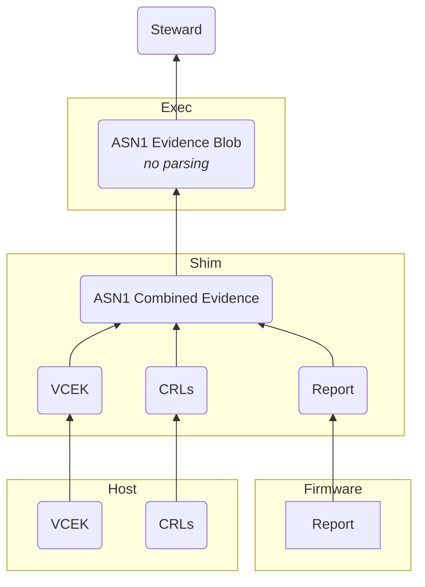

# SNP Specific Evidence Blob Composition

###### tags: `Design`
| Author | Period | State |
| -------- | -------- | -------- |
| Nathaniel McCallum Dmitri Pal | January 2023 | :red_circle: **Draft** |

